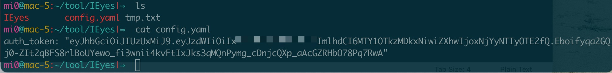
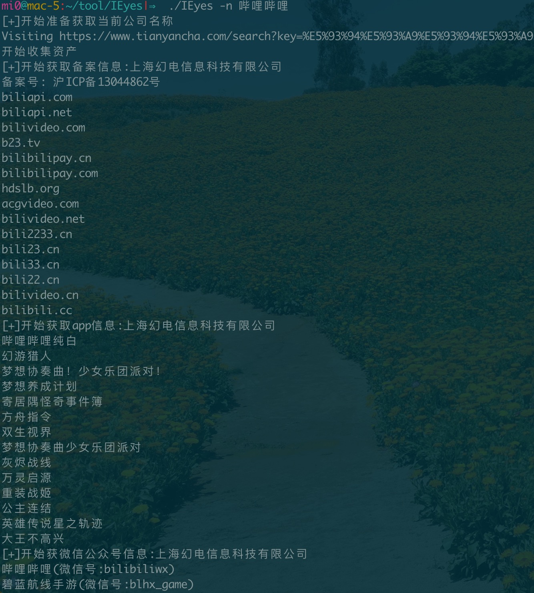
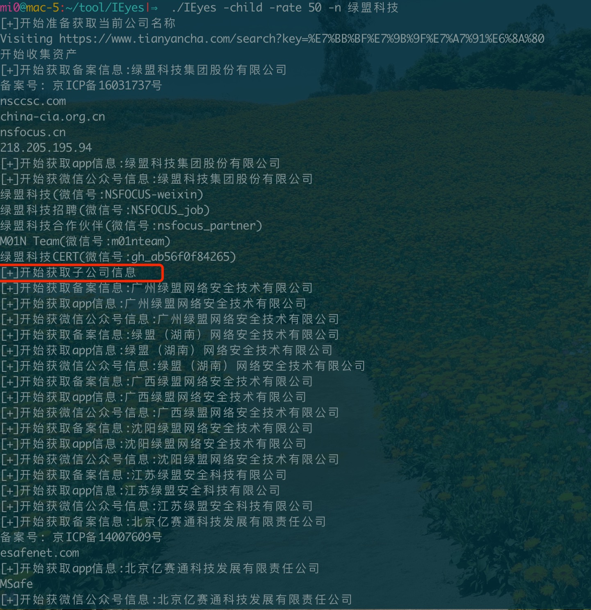
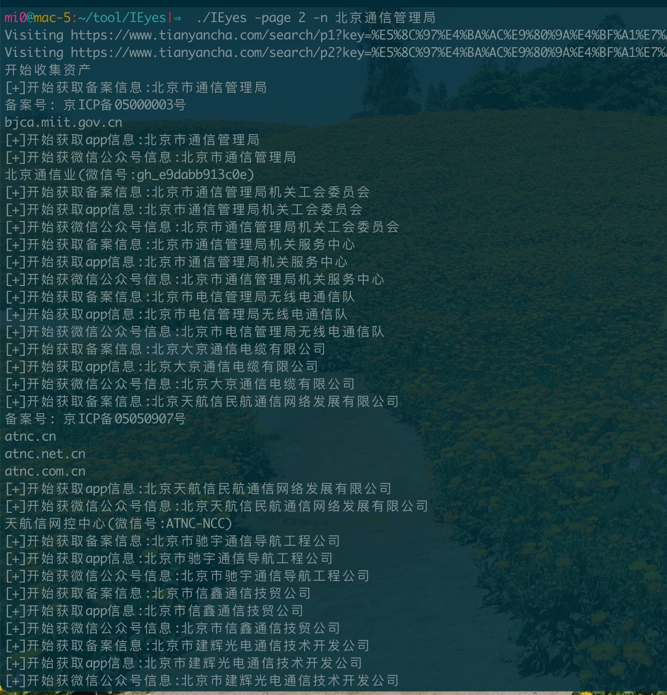
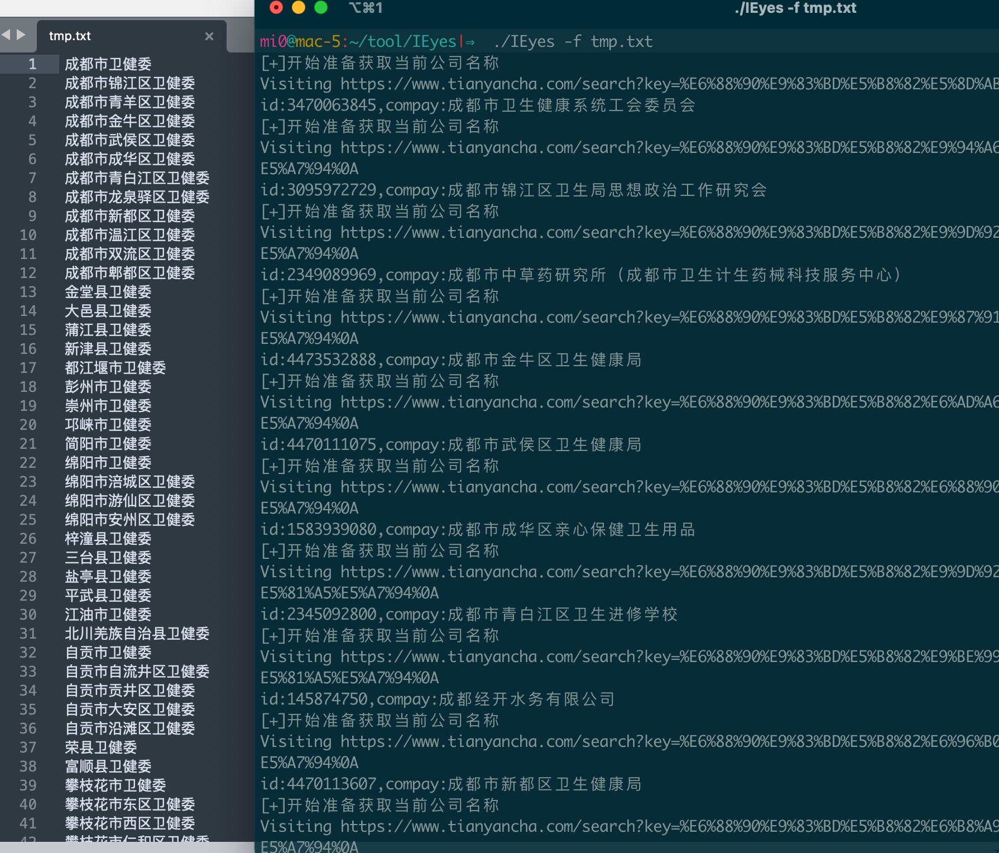
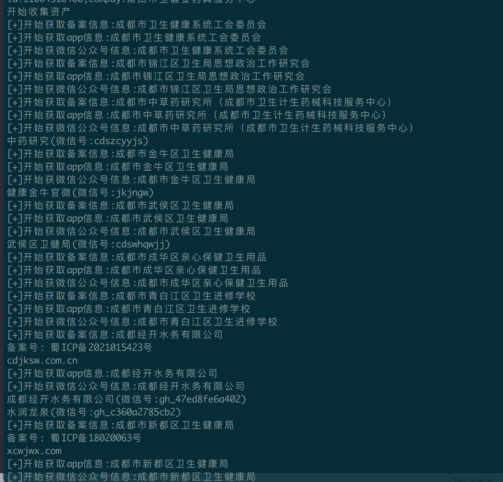

## IEyes


企业资产快速收集工具

本工具主要通过天眼查接口进行快速的资产收集，收集内容包括备案域名、公众号、APP，以及其子公司，投资公司的信息，支持递归深度搜索子公司


在查询企业子公司时主要分为4类企业单位场景，除了4以外整体我都简化一并查询

1. 中小企业，集团公司，这类公司有自己的子公司，子公司也是我们收集的范围
2. 大型厂商，比如腾讯阿里这类，这类公司主要以投资的形式拥有着一大批子公司，投资比例越高越和母公司关联性强
3. 银行，运营商之类单位，这类公司主要是以分支机构为子公司业务开展，整个体系十分庞大
4. 政府单位，政府单位之间在天眼查上没有多大的关联，没有所谓的谁是谁的子公司说法，只能通过名称的关联性进行判断


#### 配置
整个查询需要用到天眼查的cookie，这个cookie经过我测试发现有效性可长达一个月，并且只需要auth_token这个字段就可以了，因此在第一运行该程序后，会生成一个config.yaml文件，将cookie的值填入其他即可(不需要cookie名，只需要值)




#### 使用方法

```
Usage of ./IEyes:
  -child
    	是否查询子公司,默认为false
  -deep int
    	子公司查询递归深度,默认为1 (default 1)
  -f string
    	从文件中获取目标资产信息
  -n string
    	查询目标名称
  -page int
    	查询页面数
  -rate int
    	控股比例,默认为90%控股 (default 90)
```

例子1
查询目标公司
```
./IEyes -n 哔哩哔哩
```




例子2
查询目标公司和子公司，并且持股比例大于50%的

```
./IEyes -child -rate 50 -n 绿盟科技
```


例子3
查询目标公司和子公司，包含子公司的子公司，如果要查三层子公司可以使用`-deep 3`，一次类推
```
./IEyes -child -deep 2 -n 中国移动
```

例子4
查询天眼查前2页关于北京通管局相关的单位资产

```
./IEyes -page 2 -n 北京通信管理局
```



例子5
根据文件内容批量查询

```
./IEyes -f tmp.txt
```



这个模式会先搜索文本中每行在天眼查的第一个返回内容，全部搜索完毕后，会进行备案等信息查询，但这里因为某些县级单位太小了可能搜不到会有在天眼查第一行出现其他的单位，因此还需要人工进行次复选

